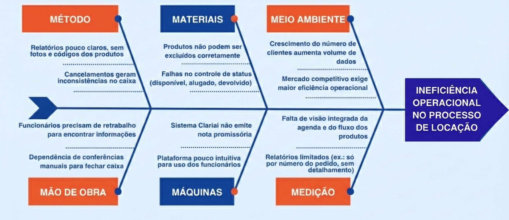

# 1. CENÁRIO ATUAL DO CLIENTE E DO NEGÓCIO

## 1.1 Introdução ao Negócio e Contexto

A **Closet Chic Compartilhado** é uma loja de moda especializada em aluguel de roupas femininas, onde o foco principal são vestidos de festa e acessórios femininos. A empresa tem se consolidado no mercado há três anos. A empresa está passando por uma expansão, uma nova loja, a Leoni, que tem maior foco no aluguel de ternos e acessórios masculinos, oferecendo soluções para atender eventos sociais e formais.

## 1.2 Identificação da Oportunidade ou Problema

Devido ao crescimento da loja, a necessidade de acabar com os problemas principais do software atual surgiram, a "Clariai", solução atual de software da empresa, tornou-se um gargalo operacional, incapaz de suportar o volume de uma única marca, e muito menos a complexidade de duas. Essa limitação tecnológica representa hoje o principal obstáculo para a expansão e o sucesso contínuo do negócio.

As falhas do sistema se manifestam diariamente e em múltiplas frentes. A ausência de um controle de status confiável do inventário (disponível, alugado, devolvido) gera inconsistências e arrisca a confiança do cliente. A equipe é forçada a um ciclo de **retrabalho e conferências manuais**, operando em uma plataforma pouco intuitiva e com relatórios limitados que impedem qualquer análise estratégica. Esses fatores acumulados criam uma operação lenta, propensa a erros e desalinhada com a agilidade que o mercado exige.

O resultado é um cenário em que a empresa, mesmo em plena expansão, não consegue atender à demanda com eficiência. Essa condição **compromete a experiência de compra**, gera insegurança no fechamento de caixa e, mais criticamente, **ameaça o lançamento bem-sucedido da Leonni**. A criação de um novo sistema próprio surge, portanto, não apenas como uma solução para os problemas atuais, mas como um passo estratégico fundamental para unificar as marcas, garantir a escalabilidade e transformar uma fraqueza operacional em um diferencial competitivo.

A Figura, a seguir, apresenta o diagrama de Ishikawa contendo as causas do problema

## 1.3 Desafios do Projeto

O projeto enfrenta alguns desafios importantes:

- **Transição de sistema:** substituir o software atual sem prejudicar o funcionamento da loja durante o período de adaptação.
- **Atender duas lojas diferentes:** garantir que Closet Chic e Leonni possam trabalhar dentro da mesma plataforma, mas com identidades diferentes em seus cadastros e relatórios.
- **Facilidade de uso:** criar uma solução simples e intuitiva para que funcionários consigam utilizá-la no dia a dia, mesmo com diferentes níveis de familiaridade com tecnologia.

## 1.4 Segmentação de Clientes

O Leoni Hub atende dois segmentos de clientes principais, definidos por suas necessidades e objetivos dentro do ambiente de trabalho:

- **Funcionários Novos (18-30 anos):** Este segmento é composto por profissionais que utilizam o sistema para tarefas operacionais diárias. Eles buscam **praticidade e eficiência**, e sua principal necessidade é uma plataforma que reduza o tempo gasto em tarefas repetitivas, como o cadastro de clientes e o agendamento de provas. Eles precisam de uma interface simples e intuitiva, que minimize erros e permita que o atendimento seja o mais ágil e fluido possível.
- **Funcionários Experientes (30-50 anos):** Este segmento abrange os líderes e gerentes que dependem do Leoni Hub para obter uma **visão analítica e estratégica do negócio**. Sua principal necessidade é acessar dados confiáveis para acompanhar o desempenho geral da empresa e tomar decisões. Eles precisam de relatórios claros e dashboards completos que permitam monitorar indicadores-chave, como o volume de vendas e a produtividade da equipe, para otimizar os resultados e o crescimento da empresa.
